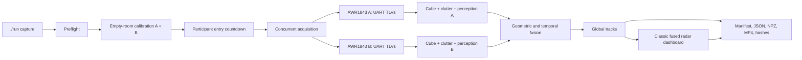

# Mmwave module architecture

## Objective

Operate two facing AWR1843BOOST radars from one server, acquire their TI
UART/TLV streams, calibrate the background, fuse
observations into one coordinate frame, and produce auditable artifacts. The
module is independent: all physical device access occurs inside this tree and
`Backend` is not required for capture.

## Execution flow



## Continuous live flow

`./run live` keeps one CLI/data owner per radar across calibration and live
operation. `live_acquisition.py` timestamps and buffers measured TLV frames,
`live_fusion.py` applies the empty-room occupancy baseline and transforms B
into A's frame, and `live_dashboard.py` publishes one classic A+B view.

The runtime state machine is:

```text
PREFLIGHT -> CALIBRATING -> ENTRY_COUNTDOWN -> LIVE -> STOPPED
                                             \-> FAULT
```

The Backend is a lifecycle and transport adapter only. It must not implement a
second clustering/fusion algorithm or open the same UART ports.

## Components and responsibilities

### 1. Operator interface

`run` resolves the application directory, selects an available Python runtime,
sets `PYTHONPATH`, selects the configuration, and invokes the orchestrator. It
contains no radar-processing logic.

### 2. Physical discovery and acquisition

`software/lab/mmwave77_usb/runner.py` enumerates each XDS110 by serial number
and USB location, resolves its CLI/data pair, and configures TI firmware with
the selected profile. `layer1_sensor_hub/radar` contains the minimal UART/TLV
parser and radar CLI client.

`/dev/ttyACM*` numbers can change after a power reset and are never treated as
persistent radar identities.

### 3. Per-radar calibration and representation

Each radar creates an independent session. `cube.py` aggregates processed
points into a range-azimuth-elevation volume. `background.py` calculates robust
empty-room statistics and a clutter mask. `perception.py` applies that
calibration and creates temporal evidence and local tracks.

### 4. Fusion

Radar B is transformed into radar A's Cartesian coordinate system using the
configured sensor separation and facing geometry. Windows are associated by
time within a defined tolerance. Fusion combines post-CFAR observations, while
`global_tracks.py` maintains one global identity when both radars observe the
same person.

This is **late fusion**, not joint beamforming or coherent ADC/IQ fusion.

The optional classic human-centric renderer selects only each source's
track-associated measured points after both clouds are transformed into the
same frame. It derives a robust display envelope from those observations and
does not voxelize, interpolate, or synthesize body returns. Its lower panels
show A/B range profiles against their independent empty-room baselines, fused
world-coordinate occupancy, and source-aware temporal evidence.

### 5. Synchronization

Both USB streams use host monotonic receipt timestamps and bounded matching.
There is no shared hardware acquisition clock, so the measured alignment error
is preserved in every live quality payload.

### 6. Persistence

Each run receives a unique timestamped directory. `manifest.json` connects
inputs, calibration sessions, outputs, and SHA-256 hashes. Per-process logs make
it possible to diagnose incomplete captures without hiding a failed stage.
The manifest separately names and hashes the synchronized triptych and the
classic fused dashboard.

## Configurations

- `configs/server_local.json`: two radars and one camera.
- `configs/server_dual_camera.json`: two radars and two cameras.

Both write under `Mmwave/data/captures`. Select a profile through
`MMWAVE_CONFIG` without editing source code.

## Scientific and safety limitations

- AWR1843 USB output contains processed detections, not raw ADC samples.
- Apparent point-cloud size is not equivalent to anatomical resolution.
- Relative SNR/RCS and persistence do not chemically identify a material.
- A reflective anomaly is not a firearm classification.
- Low-quality capture must be reported as insufficient signal, never as a
  guarantee that an object is absent.

## Backend integration

The sibling Backend starts and stops this runtime and serves its atomic JPEG
and JSON outputs. It must not import a second fusion implementation or open the
same ports. This preserves a single sensor owner and prevents duplicate device
processes.
